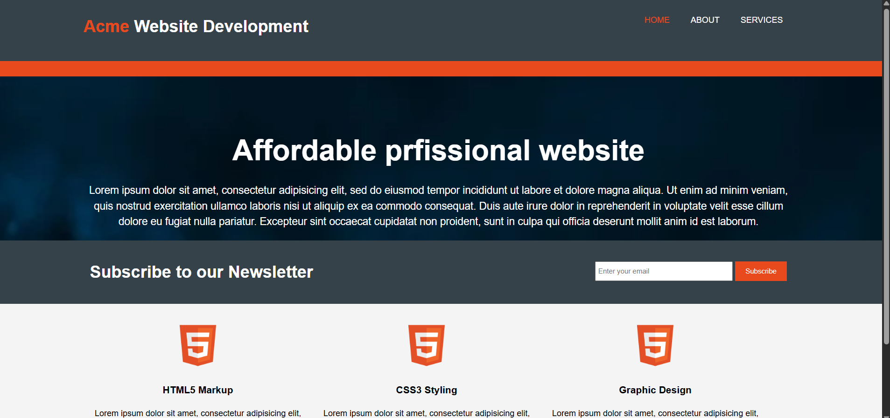
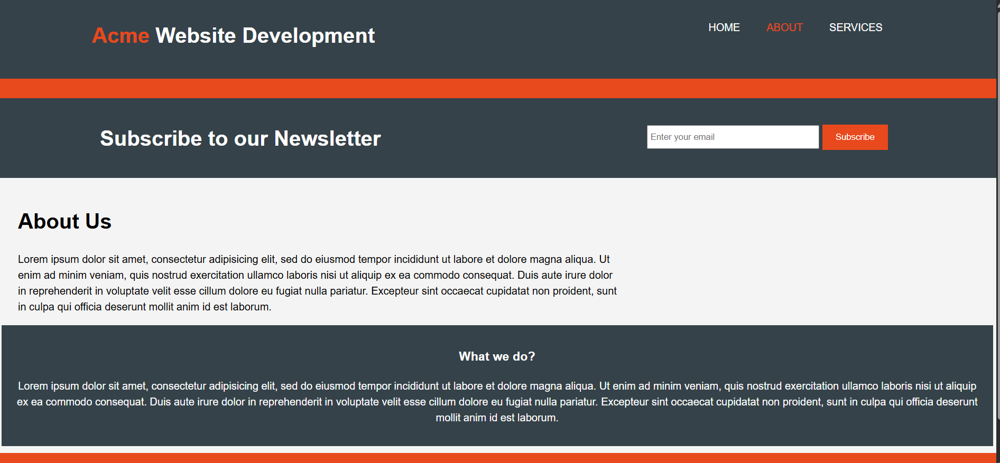
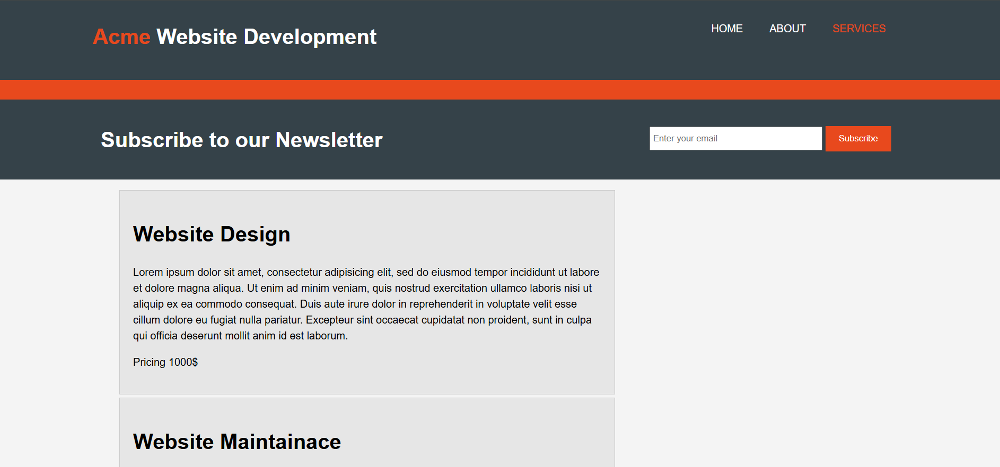
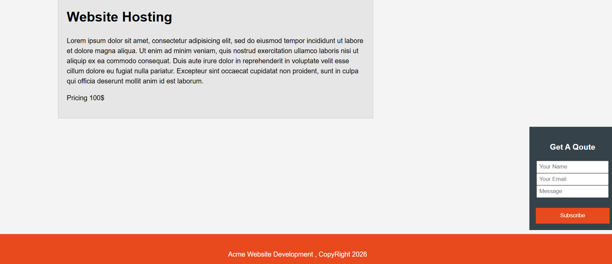

# 🚀 Acme Website Development

A responsive business website built with **HTML5** and **CSS3**. This project demonstrates modern web design principles, clean layouts, and responsive development techniques for a professional business website.

## Features

- Responsive design
- Modern landing page
- Navigation bar
- Hero section
- Services section
- About section
- Contact section
- Clean and organized layout
- Mobile-friendly interface

## Technologies Used

- HTML5
- CSS3

## 📸 Project Preview

### 🏠 Home Page



### 👤 About Page



### 💼 Services Page 1



### 💼 Services Page 2



## Project Structure

```text
acme-website-development/
├── index.html
├── style.css
├── README.md
├── images/
└── assets/
```
